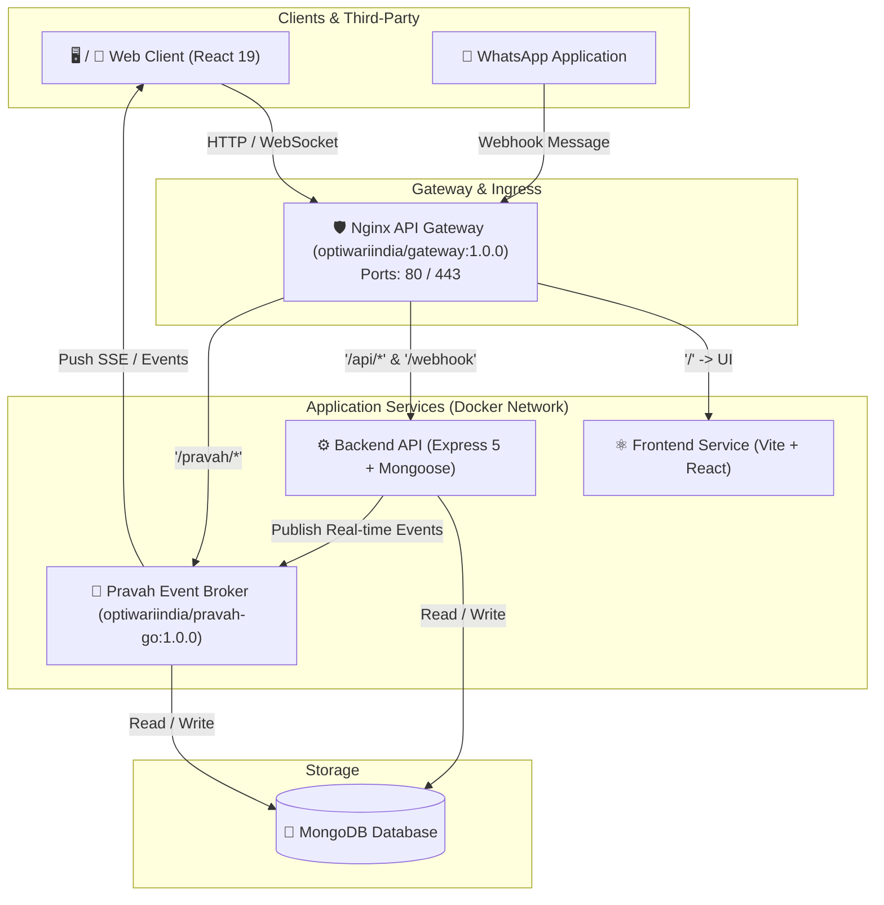
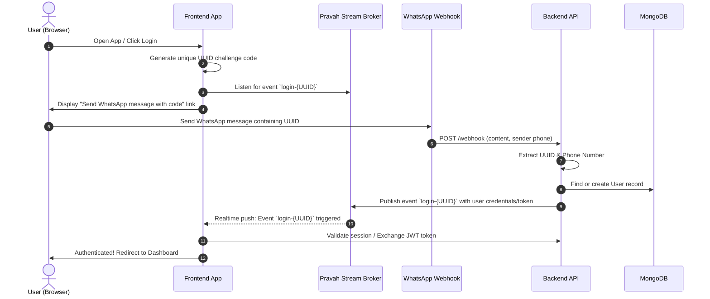

# 🥛 BizBandhan Milkman (Doodh-Wala)

[](docker-compose.yml)
[](codebase/backend)
[](codebase/frontend)
[](codebase/frontend)
[](db)
[](environment/pravah.env)

> **BizBandhan Milkman** is a B2B2C micro-SaaS platform engineered to digitize unorganized daily milk delivery operations across India. It bridges local milk vendors (*doodh-walas*) and households (clients) with real-time delivery logs, automated subscription scheduling, zero-friction WhatsApp authentication, and transparent ledger billing.

---

## 📑 Table of Contents

- [Overview & Value Proposition](#-overview--value-proposition)
- [System Architecture](#-system-architecture)
- [Key Features](#-key-features)
  - [For Milkmen (Vendors / Tenants)](#1-for-milkmen-vendors--tenants)
  - [For Households (Customers / Consumers)](#2-for-households-customers--consumers)
- [Authentication Workflow (WhatsApp-Powered)](#-authentication-workflow-whatsapp-powered)
- [Tech Stack](#-tech-stack)
- [Repository Structure](#-repository-structure)
- [Environment Configuration](#-environment-configuration)
- [Getting Started & Local Setup](#-getting-started--local-setup)
  - [Using Docker Compose (Recommended)](#using-docker-compose-recommended)
  - [Manual Development Setup](#manual-development-setup)
- [API & Gateway Routing](#-api--gateway-routing)
- [Documentation Reference](#-documentation-reference)
- [License & Authors](#-license--authors)

---

## 💡 Overview & Value Proposition

Traditional milk distribution relies on manual diaries, verbal agreements, and month-end friction over skipped deliveries or payment calculations. **BizBandhan Milkman** provides a synchronized, transparent system:

- **Zero-Friction Onboarding**: No passwords or complex sign-up forms. Users authenticate instantly via a simple WhatsApp challenge message.
- **One-Handed Mobile Delivery Tracking**: Milkmen can complete delivery rounds quickly via single-tap delivery logs (delivered, skipped, partial).
- **Vacation & Pause Controls**: Households can mark leaves or pause subscriptions ahead of time, automatically preventing delivery generation and unfair billing.
- **Synchronized Ledgers**: Real-time billing and payment reconciliation supporting Cash and UPI payments.

---

## 🏗️ System Architecture



---

## ✨ Key Features

### 1. For Milkmen (Vendors / Tenants)
- **Delivery Route View**: Daily interactive route sheet with quick status updates (Mark Delivered / Partial / Skipped).
- **Customer Directory**: Manage household profiles, subscription preferences, contact numbers, and delivery addresses.
- **Product Catalog**: Configure products (Cow Milk, Buffalo Milk, Full Cream, Paneer, Curd, Ghee) with custom unit prices.
- **Stock & Quantity Management**: Track morning and evening milk intake against distributed quantities to prevent deficits.
- **Ledger & Payment Tracking**: Record payments received via Cash or UPI and generate customer account statements.
- **WhatsApp Reminders**: Direct WhatsApp message generation for monthly payment dues and balance reminders.
- **Analytics Dashboard**: Daily delivery volume, active customer counts, and revenue trends.

### 2. For Households (Customers / Consumers)
- **Interactive Calendar**: View daily milk delivery history, quantities delivered, and upcoming schedules.
- **Pause & Resume Subscriptions**: Mark vacations or temporary pauses to avoid unwanted deliveries and charges.
- **Shared Family Access**: Single family account linked to household members for shared visibility.
- **Transparent Invoicing**: Real-time daily ledger entries showing exact delivery costs and payment history.

---

## 📲 Authentication Workflow (WhatsApp-Powered)

BizBandhan Milkman uses a seamless, phone-verified authentication flow powered by WhatsApp and Pravah event streaming:



---

## 🧰 Tech Stack

### Frontend
- **Framework**: React 19 (`react`, `react-dom`)
- **Build Tool**: Vite 8
- **Styling**: Tailwind CSS v4 (`@tailwindcss/vite`), Emotion CSS
- **Routing**: React Router DOM v7
- **UI & Animations**: Lucide React Icons, MUI Icons, Motion (`motion`)
- **State & Real-Time**: `pravah-sdk`, `react-api-state`, React Context

### Backend & Microservices
- **Runtime**: Node.js v26 (Alpine/Slim containers)
- **Framework**: Express 5 with modular domain routing
- **Database ODM**: Mongoose 9.x
- **Utilities**: `express-web-tools`, `jsonwebtoken`, `express-pureip`, `cookie-parser`, `express-fileupload`
- **Real-Time Broker**: Pravah Go (`optiwariindia/pravah-go:1.0.0`)
- **Reverse Proxy**: Nginx Gateway (`optiwariindia/gateway:1.0.0`)

---

## 📁 Repository Structure

```text
milkman/
├── codebase/
│   ├── backend/               # Express 5 REST API & domain modules
│   │   ├── core/              # Server bootstrap, middleware, events, and utils
│   │   ├── modules/           # Domain modules
│   │   │   ├── config/        # System configuration
│   │   │   ├── customer/      # Household/customer management
│   │   │   ├── order/         # Order creation & fulfillment
│   │   │   ├── product/       # Milk & dairy product catalog
│   │   │   ├── seller/        # Vendor/milkman business profiles
│   │   │   ├── subscription/  # Daily subscription management
│   │   │   ├── user/          # Identity, roles, JWT auth guards
│   │   │   └── webhook/       # WhatsApp incoming message webhook
│   │   └── Dockerfile
│   ├── frontend/              # React 19 + Vite + Tailwind SPA
│   │   ├── src/
│   │   │   ├── components/    # Reusable UI & modal components
│   │   │   ├── context/       # Auth, User, and Config context providers
│   │   │   ├── Layouts/       # Milkman, Customer, and Visitor layouts
│   │   │   ├── pages/         # MilkmanDashboard, Customer views, etc.
│   │   │   └── Routes/        # Application route definitions
│   │   ├── vite.config.js
│   │   └── Dockerfile
│   └── gateway/               # Nginx reverse proxy configuration & logs
│       └── config/            # Routing maps, log formats, and upstream rules
├── db/                        # MongoDB persistent storage, config, and backups
├── docs/                      # PRD, Architecture Blueprints, FRD, and User Stories
├── environment/               # Environment variables configuration
│   ├── backend.env
│   └── pravah.env
└── docker-compose.yml         # Full multi-container Docker composition
```

---

## ⚙️ Environment Configuration

Configuration files are located in the [`environment/`](environment/) directory:

### Backend (`environment/backend.env`)
```env
PORT=3000
DB=mongodb://db/milkman
SESSION_SECRET=your_session_secret_key
JWT_SECRET=your_jwt_secret_key
PRAVAH_API_KEY=your_pravah_api_key
PRAVAH_URL=http://pravah:3000
origin="milkman.bizbandhan.com"
```

### Pravah Event Service (`environment/pravah.env`)
```env
PORT=3000
MONGODB=mongodb://db/pravah
```

---

## 🚀 Getting Started & Local Setup

### Prerequisites
- [Docker](https://docs.docker.com/get-docker/) and [Docker Compose](https://docs.docker.com/compose/install/) (v2.0+)
- Node.js v22+ / v26 (for local development outside containers)
- npm or yarn

### Using Docker Compose (Recommended)

1. **Clone the repository:**
   ```bash
   git clone https://github.com/bizBandhan/milkman.git
   cd milkman
   ```

2. **Create the external docker network (if not already created):**
   ```bash
   docker network create publicweb || true
   ```

3. **Launch the entire stack:**
   ```bash
   docker compose up --build
   ```

4. **Access the application:**
   - **Frontend Application**: `http://localhost` (or mapped host domain)
   - **Backend API**: `http://localhost/api/v1`
   - **Webhook Endpoint**: `http://localhost/webhook`
   - **Pravah Event Stream**: `http://localhost/pravah/`

---

### Manual Development Setup

If you prefer to run services individually:

#### 1. Start MongoDB
```bash
docker run -d --name milkman-mongo -p 27017:27017 mongo:latest
```

#### 2. Start Backend
```bash
cd codebase/backend
npm install
npm run dev
```

#### 3. Start Frontend
```bash
cd codebase/frontend
npm install
npm run dev
```

---

## 🔌 API & Gateway Routing

The Nginx Gateway routes requests based on URI paths:

| Path Pattern | Destination Service | Description |
| :--- | :--- | :--- |
| `/` | `frontend:3000` | React Single Page Application |
| `/api/v1/user/*` | `backend:3000` | User profile & authentication routes |
| `/api/v1/seller/*` | `backend:3000` | Milkman business & shop settings |
| `/api/v1/product/*` | `backend:3000` | Product catalog CRUD |
| `/api/v1/config/*` | `backend:3000` | Global platform configuration |
| `/webhook` | `backend:3000` | WhatsApp webhook ingestion |
| `/pravah/*` | `pravah:3000` | Pravah real-time event streaming & SSE |

---

## 📚 Documentation Reference

For in-depth architectural and product specifications, refer to the documentation in [`docs/docs/`](docs/docs/):

- 📄 [Product Requirements Document (PRD)](docs/docs/PRD.md)
- 📐 [Consolidated Project Blueprint](docs/docs/BLUEPRINT_COMPLETE.md)
- 👥 [User Stories & Acceptance Criteria](docs/docs/USER_STORIES.md)
- 📋 [Functional Requirements Document (FRD)](docs/docs/FRD.md)
- ⚡ [Non-Functional Requirements (NFR)](docs/docs/NFR.md)
- 📊 [Competition Analysis](docs/docs/COMPETITION_ANALYSIS.md)
- 🔐 [Backend Authentication Specifications](docs/docs/BackendAuthentication:.md)

---

## 👥 Authors & License

- **Author**: Om Prakash Tiwari ([optiwari.india@gmail.com](mailto:optiwari.india@gmail.com)) & BizBandhan Team
- **License**: ISC License
